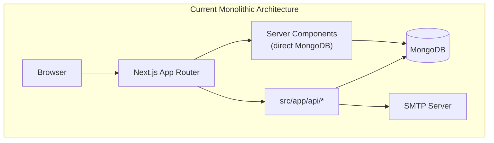
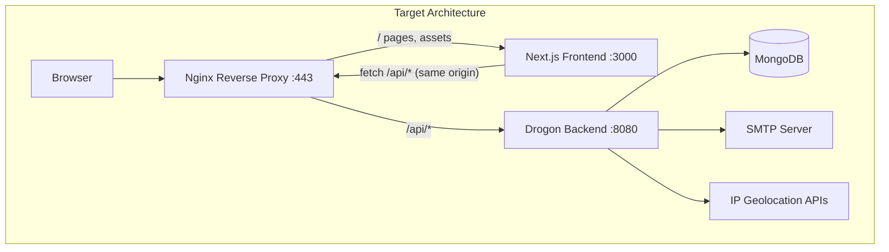
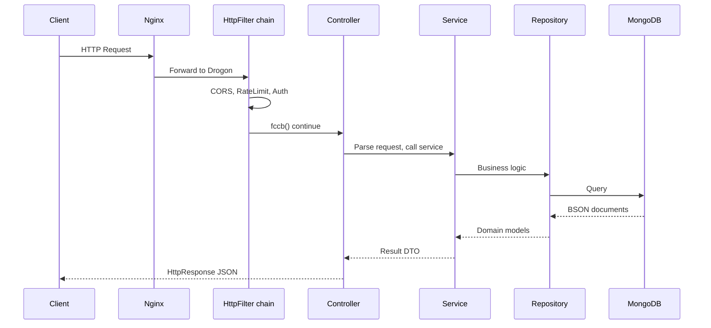

# Portfolio Application — Drogon Migration Architecture Blueprint

> **Purpose:** Complete architecture document and step-by-step migration blueprint for splitting a monolithic Next.js full-stack portfolio into:
>
> - **Frontend:** Next.js (App Router, frontend only)
> - **Backend:** Drogon (C++ REST API)
> - **Database:** MongoDB
>
> Use this document to bootstrap **two fresh repositories** from scratch. Nothing in this document assumes you have already started the migration.

---

## Table of Contents

1. [Executive Summary](#1-executive-summary)
2. [Current Architecture](#2-current-architecture)
3. [Target Architecture](#3-target-architecture)
4. [Express.js → Drogon Concept Map](#4-expressjs--drogon-concept-map)
5. [Fresh Repository Layout](#5-fresh-repository-layout)
6. [Complete Folder Classification](#6-complete-folder-classification)
7. [MongoDB Data Model Reference](#7-mongodb-data-model-reference)
8. [REST API Contract Reference](#8-rest-api-contract-reference)
9. [Feature-by-Feature Migration Map](#9-feature-by-feature-migration-map)
10. [Drogon Backend Project Design](#10-drogon-backend-project-design)
11. [Next.js Frontend Project Design](#11-nextjs-frontend-project-design)
12. [C++ Dependency Stack](#12-c-dependency-stack)
13. [Configuration & Environment Variables](#13-configuration--environment-variables)
14. [Security Fixes Required During Migration](#14-security-fixes-required-during-migration)
15. [Nginx & Deployment](#15-nginx--deployment)
16. [Phased Migration Roadmap](#16-phased-migration-roadmap)
17. [Risk Register](#17-risk-register)
18. [What NOT to Migrate](#18-what-not-to-migrate)
19. [Appendix A — API Consumer Map](#appendix-a--api-consumer-map)
20. [Appendix B — Analytics Service Functions](#appendix-b--analytics-service-functions)
21. [Appendix C — Drogon Learning Guide for Express Developers](#appendix-c--drogon-learning-guide-for-express-developers)
22. [Appendix D — Production Checklist](#appendix-d--production-checklist)

---

## 1. Executive Summary

### What exists today

A production Next.js 14 portfolio application (`mahbub.dev`) where:

- The **frontend** renders portfolio sections (banner, skills, projects, experience, education, contact).
- The **backend** lives inside `src/app/api/*` as Next.js API Routes.
- **MongoDB** is accessed directly from API routes and some Server Components.
- **PM2** runs a standalone Next.js build on port `3000`.

### What you are building

| Layer | Technology | Responsibility |
|-------|------------|----------------|
| Frontend | Next.js 14 (App Router) | UI, SSR pages, client tracking instrumentation, charts |
| API | Drogon (C++) | All business logic, auth, DB, email, PDF, analytics |
| Database | MongoDB | Same database — no schema migration required initially |
| Proxy | Nginx | Route `/` → Next.js, `/api/*` → Drogon |

### Key decisions (locked in)

| Decision | Choice |
|----------|--------|
| PDF generation | Full C++ with **PoDoFo** (port from jsPDF) |
| Deployment | Same VPS, Nginx reverse proxy |
| Frontend API URL | Same origin (`/api/*` via Nginx) — no frontend URL changes needed |
| Auth token storage | JWT in `localStorage` (keep existing frontend pattern) |

---

## 2. Current Architecture



### Current API inventory

| Route | Methods | Auth today | Primary concern |
|-------|---------|------------|-----------------|
| `/api/auth/login` | POST, GET | None | JWT issuance, session tracking, cleanup job |
| `/api/auth/logout` | POST, DELETE | None | Session invalidation, forced logout |
| `/api/auth/login-history` | GET | **None (gap)** | Login audit log |
| `/api/portfolio` | GET, POST | POST: JWT | Portfolio CRUD |
| `/api/portfolio/[col]/[id]` | PUT, DELETE | **Hostname only (gap)** | Item update/delete |
| `/api/upload-image` | POST | **Hostname only (gap)** | Base64 image storage |
| `/api/analytics` | GET | JWT | Dashboard aggregations |
| `/api/analytics/track` | POST | None | Event ingestion |
| `/api/visitors` | POST, GET | GET: JWT | Visitor tracking |
| `/api/contact` | POST | None | SMTP email |
| `/api/resume` | GET, POST | None | Dynamic PDF (jsPDF) |
| `/api/sitemap` | GET | None | XML sitemap |

### Current source tree (134 files)

```
react_portfolio/
├── src/
│   ├── app/                    # Pages + API routes
│   │   ├── api/                # ← ALL BACKEND (to be removed)
│   │   ├── analytics/
│   │   ├── contact/
│   │   ├── projects/
│   │   ├── skills/
│   │   ├── layout.js
│   │   ├── page.js
│   │   ├── globals.css
│   │   ├── robots.js
│   │   └── sitemap.js
│   ├── components/             # UI components
│   ├── contexts/               # Auth + theme context
│   ├── hooks/                  # Client data hooks
│   ├── lib/                    # Backend utilities (split/remove)
│   ├── models/                 # Mongoose schemas (move to Drogon)
│   ├── services/               # Business logic (move to Drogon)
│   ├── config/                 # Admin/RBAC config (move to Drogon)
│   ├── Utils/                  # Chart formatters, sitemap helper
│   └── middleware.js           # Rate limit + security headers
├── scripts/                    # Build, seed
├── public/                     # Static assets
├── db.json                     # Seed data
├── package.json
├── next.config.js
├── ecosystem.config.js
└── .github/workflows/deploy.yml
```

---

## 3. Target Architecture



### Request flow example

1. User visits `https://mahbub.dev/`
2. Nginx proxies to Next.js `:3000`
3. Next.js Server Component calls `GET /api/portfolio`
4. Nginx proxies `/api/portfolio` to Drogon `:8080`
5. Drogon `PortfolioController` → `PortfolioService` → `PortfolioRepository` → MongoDB
6. JSON response flows back to Next.js → rendered HTML

### Two-repository model

```
portfolio-frontend/     # Fresh Next.js repo (UI only)
portfolio-api/          # Fresh Drogon repo (REST API only)
```

Both repos deploy to the same VPS. Nginx stitches them together.

---

## 4. Express.js → Drogon Concept Map

If you know Express.js, learn Drogon through these mappings:

| Express.js | Drogon | Notes |
|------------|--------|-------|
| `const app = express()` | `drogon::app()` in `main.cc` | Application singleton |
| `app.listen(3000)` | `config.json` listeners + `app().run()` | Port configured in JSON |
| `express.Router()` | `HttpController` subclass | One controller per domain |
| `router.get('/path', handler)` | `METHOD_ADD(Controller::method, "/path", Get)` | Macro-based route registration |
| `router.post('/path', auth, handler)` | `METHOD_ADD(..., Post, "AuthFilter")` | Per-route filter by name |
| `app.use(middleware)` | `HttpFilter` + `registerFilter()` | Cross-cutting concerns |
| `app.use(cors())` | `CorsFilter` or `drogon::plugin::Cors` | CORS handling |
| `app.use(express.json())` | Built-in — Drogon parses JSON automatically | No body-parser needed |
| `req.body` | `req->getJsonObject()` | Returns `Json::Value` |
| `req.params.id` | `req->getParameter("id")` | Path parameters |
| `req.query.days` | `req->getParameter("days")` | Query parameters |
| `req.headers['authorization']` | `req->getHeader("authorization")` | Header access |
| `res.json({ data })` | `HttpResponse::newHttpJsonResponse(json)` | JSON response |
| `res.status(401).json({})` | `resp->setStatusCode(k401Unauthorized)` | Status codes |
| `res.sendFile('file.pdf')` | `HttpResponse::newFileResponse(path)` | Binary/file responses |
| `next()` | Call `fccb()` in filter (FilterChainCallback) | Continue filter chain |
| `return res.status(401)...` (stop) | Call `fcb(resp)` in filter (FilterCallback) | Short-circuit |
| `require('./services/foo')` | `#include "services/FooService.h"` | C++ includes |
| Service class | Service class (same pattern!) | Plain C++ class, no magic |
| Mongoose `Model.find()` | Repository method with mongocxx | No ORM in C++ |
| `mongoose.Schema({...})` | C++ struct in `models/` | Type definitions |
| `process.env.JWT_SECRET` | `app().getCustomConfig()["jwt_secret"]` | Config at startup |
| `dotenv` | `config.json` + `config.local.json` | Drogon native config |
| `multer.single('image')` | `req->getUploadedFiles()` | Multipart uploads |
| `nodemailer.createTransport()` | libcurl SMTP | Contact form email |
| `jsonwebtoken.sign()` | jwt-cpp `create()` | JWT generation |
| `bcrypt.compare()` | libbcrypt / OpenSSL | Password verify |
| `node-cron` | `app().getLoop()->runEvery(duration, cb)` | Scheduled cleanup |
| `app.use((err, req, res, next) => {})` | `GlobalExceptionFilter` | Error handling |

### Drogon request lifecycle



---

## 5. Fresh Repository Layout

### Repository 1: `portfolio-api` (Drogon backend)

```
portfolio-api/
├── CMakeLists.txt
├── conanfile.txt                       # Optional dependency management
├── README.md
├── .env.example
├── config/
│   ├── config.json                     # Drogon app config
│   └── config.local.json               # Dev overrides (gitignored)
├── main/
│   └── main.cc                         # int main() { app().run(); }
├── controllers/
│   ├── HealthController.h / .cc
│   ├── AuthController.h / .cc
│   ├── PortfolioController.h / .cc
│   ├── AnalyticsController.h / .cc
│   ├── VisitorController.h / .cc
│   ├── ContactController.h / .cc
│   ├── ResumeController.h / .cc
│   ├── SitemapController.h / .cc
│   └── UploadController.h / .cc
├── filters/
│   ├── CorsFilter.h / .cc
│   ├── AuthFilter.h / .cc
│   ├── PermissionFilter.h / .cc
│   ├── RateLimitFilter.h / .cc
│   ├── SecurityHeadersFilter.h / .cc
│   └── GlobalExceptionFilter.h / .cc
├── services/
│   ├── AuthService.h / .cc
│   ├── PortfolioService.h / .cc
│   ├── AnalyticsService.h / .cc
│   ├── VisitorService.h / .cc
│   ├── ContactService.h / .cc
│   ├── ResumeService.h / .cc
│   ├── UploadService.h / .cc
│   ├── IpGeolocationService.h / .cc
│   └── SitemapService.h / .cc
├── repositories/
│   ├── MongoClient.h / .cc
│   ├── PortfolioRepository.h / .cc
│   ├── AnalyticsRepository.h / .cc
│   ├── VisitorRepository.h / .cc
│   └── AuthRepository.h / .cc
├── models/
│   ├── PortfolioData.h
│   ├── Analytics.h
│   ├── Visitor.h
│   ├── LoginAttempt.h
│   ├── AdminSession.h
│   └── LogoutEvent.h
├── dto/
│   ├── requests/
│   │   ├── LoginRequest.h
│   │   ├── ContactRequest.h
│   │   ├── PortfolioCreateRequest.h
│   │   ├── PortfolioUpdateRequest.h
│   │   └── AnalyticsTrackRequest.h
│   └── responses/
│       ├── ApiResponse.h
│       ├── PortfolioResponse.h
│       ├── AnalyticsStatsResponse.h
│       └── AuthResponse.h
├── utils/
│   ├── JwtUtils.h / .cc
│   ├── PasswordUtils.h / .cc
│   ├── SanitizeUtils.h / .cc
│   ├── ResponseUtils.h / .cc
│   ├── EmailValidator.h / .cc
│   └── DateUtils.h / .cc
├── resources/
│   └── resume_content.json
├── plugins/
│   └── MongoPlugin.h / .cc
├── migrations/
│   └── seed_portfolio.cpp
├── tests/
│   ├── test_auth.cpp
│   ├── test_portfolio.cpp
│   └── test_resume_pdf.cpp
├── docker/
│   └── Dockerfile
└── scripts/
    ├── build.sh
    └── deploy.sh
```

### Repository 2: `portfolio-frontend` (Next.js frontend)

```
portfolio-frontend/
├── src/
│   ├── app/
│   │   ├── layout.js                   # Root layout, providers
│   │   ├── page.js                     # Home — fetch /api/portfolio
│   │   ├── globals.css
│   │   ├── contact/page.js
│   │   ├── projects/page.js
│   │   ├── skills/page.js
│   │   ├── analytics/page.js
│   │   ├── robots.js
│   │   └── sitemap.js                  # Or proxy to Drogon
│   ├── components/
│   │   ├── analytics/                  # 15 chart components (display only)
│   │   ├── auth/LoginModal.jsx
│   │   ├── banner/
│   │   ├── contact/
│   │   ├── educations/
│   │   ├── experiences/
│   │   ├── navbar/
│   │   ├── projects/
│   │   ├── skills/
│   │   ├── SEO/
│   │   ├── AnalyticsTracker.jsx
│   │   ├── VisitorCounter.js
│   │   ├── VisitorAnalytics.jsx
│   │   └── Footer.jsx
│   ├── contexts/
│   │   ├── useAllContext.js            # JWT auth state
│   │   └── ThemeContext.js
│   ├── hooks/
│   │   ├── usePortfolioData.js
│   │   ├── useAnalyticsData.js
│   │   └── useWorldMap.js
│   ├── lib/
│   │   ├── apiClient.js                # NEW: centralized fetch wrapper
│   │   ├── getPortfolioData.js         # REFACTOR: HTTP fetch, not MongoDB
│   │   └── portfolioFallback.js        # Optional offline fallback
│   ├── services/
│   │   └── interactionTracker.js       # Browser-only event helpers
│   └── Utils/
│       └── analytics/                  # Chart formatters (frontend only)
├── public/
├── package.json                        # NO mongoose, bcrypt, jwt, nodemailer, jspdf
├── next.config.js
├── .env.example
└── ecosystem.config.js                 # PM2 frontend only
```

---

## 6. Complete Folder Classification

Every folder/file from the original project, classified for the fresh repos.

### `src/app/`

| Path | Purpose | Target repo | Action |
|------|---------|-------------|--------|
| `page.js` | SSR home page | Frontend | Refactor: fetch `/api/portfolio` |
| `layout.js` | Root layout, metadata, providers | Frontend | Keep |
| `contact/page.js` | Contact page shell | Frontend | Keep |
| `projects/page.js` | Projects sub-page | Frontend | Refactor: fetch API |
| `skills/page.js` | Skills sub-page | Frontend | Refactor: fetch API |
| `analytics/page.js` | Admin dashboard | Frontend | Keep (calls `/api/analytics`) |
| `globals.css` | Global styles | Frontend | Keep |
| `sitemap.js` | Next.js sitemap | Frontend | Keep or proxy to Drogon |
| `robots.js` | robots.txt | Frontend | Keep |
| `api/**` | All backend logic | **Remove** | Delete after migration |

### `src/components/`

| Subfolder / File | Purpose | Target | API calls |
|------------------|---------|--------|-----------|
| `banner/` | Hero, resume download | Frontend | `GET /api/resume` |
| `navbar/` | Navigation, logout | Frontend | `POST /api/auth/logout` |
| `contact/` | Contact form | Frontend | `POST /api/contact` |
| `skills/`, `projects/`, `experiences/`, `educations/` | Display sections | Frontend | Props from API |
| `analytics/` (15 files) | Chart UI | Frontend | None (display only) |
| `auth/LoginModal.jsx` | Login UI (**unwired**) | Frontend | `POST /api/auth/login` — wire to Navbar |
| `AnalyticsTracker.jsx` | Client tracking | Frontend | `POST /api/analytics/track` |
| `VisitorCounter.js` | Visitor tracking | Frontend | `POST /api/visitors` (remove ipify) |
| `VisitorAnalytics.jsx` | Admin widget | Frontend | `GET /api/analytics`, login-history |
| `SEO/` | Metadata helpers | Frontend | None |
| `config/ConfigButton.jsx` | Admin button (**unwired**) | Frontend | Wire or remove |
| `ModalView.js` | CRUD modal (**stubbed**) | Frontend | Wire to portfolio API |
| `Home.jsx` | Legacy shell | **Remove** | Unused |
| `Footer.jsx`, `LoadingScreen.jsx` | UI | Frontend | None |

### `src/hooks/`

| File | Purpose | Target | Action |
|------|---------|--------|--------|
| `usePortfolioData.js` | Portfolio CRUD client | Frontend | Add `Authorization` header on writes |
| `useAnalyticsData.js` | Dashboard data | Frontend | Keep |
| `useWorldMap.js` | Static geojson | Frontend | Keep |
| `useVisitorTracker.js` | Duplicate tracker | **Remove** | Dead code |

### `src/contexts/`

| File | Purpose | Target | Action |
|------|---------|--------|--------|
| `useAllContext.js` | JWT in localStorage, `makeAuthenticatedRequest` | Frontend | Keep; token from Drogon |
| `ThemeContext.js` | Dark/light theme | Frontend | Keep |

### `src/lib/`

| File | Purpose | Target | Action |
|------|---------|--------|--------|
| `mongodb.js` | Mongoose connection | **Remove** | Move to Drogon `MongoClient` |
| `auth.js` | JWT, bcrypt, sanitize | **Remove** | Move to Drogon `utils/` + `filters/` |
| `getPortfolioData.js` | Server DB fetch | Frontend | Refactor to HTTP fetch |
| `portfolioFallback.js` | Static fallback | Frontend | Optional keep |
| `generateResumePdf.js` | jsPDF builder (475 lines) | **Remove** | Move to Drogon `ResumeService` + PoDoFo |
| `resumeContent.js` | Static resume sections | **Remove** | Move to `resources/resume_content.json` |
| `resumeConfig.js` | `RESUME_MODE` switch | **Remove** | Move to Drogon config |

### `src/models/` → Move entirely to Drogon

| Model | Drogon location |
|-------|-----------------|
| `PortfolioData.js` | `models/PortfolioData.h` + `repositories/PortfolioRepository` |
| `Analytics.js` | `models/Analytics.h` + `repositories/AnalyticsRepository` |
| `Visitor.js` | `models/Visitor.h` + `repositories/VisitorRepository` |
| Inline: `LoginAttempt`, `AdminSession`, `LogoutEvent` | `models/` + `repositories/AuthRepository` |

### `src/services/`

| File | Target | Action |
|------|--------|--------|
| `analyticsService.js` | Drogon `AnalyticsService.cc` | Port all 7 functions |
| `ipGeolocation.js` | Drogon `IpGeolocationService.cc` | Port |
| `interactionTracker.js` | Frontend | Keep (browser-only) |

### `src/config/`

| File | Target | Action |
|------|--------|--------|
| `admin.js` | Drogon config + `AuthService` | Port RBAC |
| `security.js` | **Remove** | Dead code (never imported) |

### `src/middleware.js`

| Concern | Target | Action |
|---------|--------|--------|
| Security headers | Nginx | Move to Nginx config |
| Rate limiting | Drogon `RateLimitFilter` + Redis | Port |
| Bot blocking | Nginx or Drogon filter | Port |
| Query sanitization | Drogon filter | Port |

### `src/Utils/`

| Path | Target | Action |
|------|--------|--------|
| `Utils/analytics/*` | Frontend | Keep (chart formatters) |
| `Utils/generateSitemap.js` | Drogon `SitemapService` | Port logic |
| `Utils/StaticData.js` | Frontend or shared JSON | Keep |

### `scripts/`

| Script | Target | Action |
|--------|--------|--------|
| `seedProjects.js` | Drogon seeder or API-based script | Port |
| `build-production.js` | Frontend deploy script | Update for two-artifact deploy |
| `build-production.sh` | Frontend deploy script | Update |

### Root files

| File | Target | Action |
|------|--------|--------|
| `package.json` | Frontend | Remove backend deps |
| `next.config.js` | Frontend | Remove `/api` headers; update rewrites |
| `ecosystem.config.js` | Both repos | Split: frontend PM2 + backend PM2 |
| `env.example` | Both repos | Split into `frontend.env` + `backend.env` |
| `db.json` | Backend seeder | Import via Drogon seed script |

---

## 7. MongoDB Data Model Reference

Port these schemas exactly to mongocxx. Collection names match Mongoose model names.

### Collection: `portfoliodatas`

```javascript
{
  collectionName: String,    // enum: profile|Skills|Experiences|Projects|Educations|Banner|About|Contact
  data: Mixed,             // shape varies by collectionName (see below)
  lastUpdate: Date,
  createdAt: Date,         // timestamps
  updatedAt: Date
}
// Index: { collectionName: 1 } unique
```

**`data` shapes by `collectionName`:**

| collectionName | data shape |
|----------------|------------|
| `profile` | `{ name, title, bio, image, email, phone, location, github, linkedin, company, website, imageMetadata? }` |
| `Banner` | `{ name, jobTitle, location, bio, socialLinks }` |
| `Skills` | `[{ id, name, src }]` |
| `Experiences` | `[{ id, name, time, how }]` |
| `Educations` | `[{ id, time, name, degName, cgpa, group, Department?, Thesis? }]` |
| `Projects` | `[{ id, name, src, desc, lang[], githubUrl, liveUrl }]` |
| `Contact` | `{ contactInfo: { email, phone, location, website } }` |
| `About` | Mixed |

**Bug to fix during migration:** POST validation allows `Education`/`Experience` but enum uses `Educations`/`Experiences`.

### Collection: `analytics`

```javascript
{
  sessionId: String,       // required
  ip: String,              // required
  userAgent: String,       // required
  page: String,            // required
  country, city, region, timezone: String,
  screenResolution, viewport, platform, language, referrer: String,
  deviceType: String,      // enum: desktop|mobile|tablet|unknown
  visitNumber: Number,
  timeOnPage: Number,
  entryTimestamp: Date,
  exitTimestamp: Date,
  mouseEvents: { clicks, moves, scrolls, mouseUps, mouseDowns, mouseWheels: Number },
  keyboardEvents: { keyPresses, keyDowns, keyUps: Number },
  mouseHoldDuration, totalClicksOnPage, totalScrollDistance, maxScrollDepth: Number,
  componentsInteracted: [{ component, interactionType, timestamp, metadata }],
  aggregatedInteractions: [{ component, count, firstInteraction, lastInteraction, types, positions[] }],
  interactionTimeline: [{ eventType, timestamp, position{x,y}, target, page, scrollDepth, viewport, delay }],
  idlePeriods: [{ duration, timestamp, beforeComponent }],
  activeTime: Number,
  browserEvents: { focus, blur, resize, load: Number },
  visibilityEvents: { hidden, visible, totalHiddenTime, totalVisibleTime: Number },
  clickPositions: [{ x, y, timestamp }],
  mousePositions: [{ x, y, timestamp }],
  timestamp: Date,
  createdAt, updatedAt: Date
}
// Indexes: timestamp(-1), sessionId, ip, page, referrer, language, deviceType, country
// Upsert key: sessionId + page
```

**Array size caps (enforced server-side on track):**

| Field | Max items |
|-------|-----------|
| `componentsInteracted` | 100 |
| `clickPositions` | 50 |
| `mousePositions` | 100 |
| `aggregatedInteractions` | 50 (service stores last 50) |
| `interactionTimeline` | 100 (service stores last 100) |
| `idlePeriods` | 20 (service stores last 20) |

### Collection: `visitors`

```javascript
{
  ip: String,              // required
  userAgent: String,       // required
  page: String,            // required
  timestamp: Date,
  country, city, region, timezone, referrer, screenResolution, language: String,
  createdAt, updatedAt: Date
}
// Indexes: timestamp(-1), page, ip, referrer, language
```

### Collection: `loginattempts` (inline schema today)

```javascript
{
  username: String,
  timestamp: Date,
  userAgent: String,
  ip / ipAddress: String,
  success: Boolean,
  country, city, region, timezone: String,
  createdAt: Date,
  expiresAt: Date          // TTL: 90 days retention
}
```

### Collection: `adminsessions` (inline schema today)

```javascript
{
  userId: String,
  username: String,
  token: String,
  userAgent: String,
  ipAddress: String,
  createdAt: Date,
  expiresAt: Date,
  lastActivity: Date,
  isActive: Boolean
}
```

### Collection: `logoutevents` (inline schema today)

```javascript
{
  userId: String,
  username: String,
  timestamp: Date,
  userAgent: String,
  ipAddress: String,
  reason: String,
  sessionDuration: Number,
  createdAt: Date,
  expiresAt: Date          // TTL: 90 days retention
}
```

---

## 8. REST API Contract Reference

Maintain these contracts so the existing frontend works without changes.

### Auth

#### `POST /api/auth/login`

**Request:**
```json
{ "username": "mahbub", "password": "..." }
```

**Success response (200):**
```json
{
  "success": true,
  "token": "<JWT>",
  "user": { "userId": "...", "username": "mahbub", "role": "admin" }
}
```

**JWT payload (must match frontend `useAllContext.js`):**
```json
{ "userId": "string", "username": "string", "role": "admin|super_admin|editor|viewer", "iat": 0, "exp": 0 }
```

**Failure (401):**
```json
{ "error": "Invalid credentials", "remainingAttempts": 3 }
```

**Rate limit:** 5 attempts / 15 min per username.

#### `POST /api/auth/logout`

**Request:**
```json
{ "username": "mahbub" }
```

#### `DELETE /api/auth/logout?username=X&reason=admin_forced`

**Requires JWT in Drogon** (security fix).

#### `GET /api/auth/login-history`

**Requires JWT in Drogon** (security fix).

**Response:**
```json
{
  "attempts": [...],
  "stats": { "total": 0, "success": 0, "failed": 0, "successRate": "0%" },
  "recentSuccessful": [...]
}
```

#### `GET /api/auth/login`

Session cleanup cron endpoint. **Protect with internal token or admin JWT in Drogon.**

---

### Portfolio

#### `GET /api/portfolio`

**Auth:** None (public)

**Response:**
```json
{
  "profile": { "data": { ... }, "lastUpdate": "2024-01-01T00:00:00.000Z" },
  "Skills": { "data": [...], "lastUpdate": "..." },
  "Projects": { "data": [...], "lastUpdate": "..." }
}
```

**Cache header:** `public, s-maxage=3600, stale-while-revalidate`

#### `POST /api/portfolio`

**Auth:** JWT + `write:portfolio` permission

**Request:**
```json
{ "collectionName": "Skills", "newItem": { "name": "React", "src": "/..." } }
```

**Allowed collections:** `Skills`, `Projects`, `Educations`, `Experiences`, `Contact`

#### `PUT /api/portfolio/:collectionName/:documentId`

**Auth:** JWT + `write:portfolio` (**security fix — was hostname only**)

#### `DELETE /api/portfolio/:collectionName/:documentId`

**Auth:** JWT + `delete:portfolio` (**security fix**)

---

### Upload

#### `POST /api/upload-image`

**Auth:** JWT (**security fix — was hostname only**)

**Content-Type:** `multipart/form-data`

**Fields:**
- `image` (file, required) — JPEG/PNG/GIF/WebP, max 2MB
- `collectionName` (default: `profile`)
- `documentId` (default: `profile`)

**Behavior:** Converts to base64 data URL, updates `PortfolioData.data.image`.

---

### Analytics

#### `POST /api/analytics/track`

**Auth:** None (public)

**Request:** Full analytics payload from `AnalyticsTracker.jsx` (see Analytics model).

**Behavior:** Resolve IP/geo server-side, cap arrays, upsert by `sessionId` + `page`.

#### `GET /api/analytics?days=14`

**Auth:** JWT + `read:analytics`

**Response:** Large JSON with summary, events, pages, devices, browsers, countries, components, trends, sessions, recent records.

---

### Visitors

#### `POST /api/visitors`

**Auth:** None

**Request:**
```json
{
  "page": "/",
  "userAgent": "...",
  "referrer": "...",
  "screenResolution": "1920x1080",
  "language": "en-US"
}
```

**Note:** Do NOT require client to send `ip`. Server resolves from `X-Forwarded-For`.

#### `GET /api/visitors`

**Auth:** JWT + `read:visitors`

**Response:** Aggregated stats (total, today, week, month, pages, devices, browsers, countries, etc.)

---

### Contact

#### `POST /api/contact`

**Auth:** None

**Request:**
```json
{ "name": "...", "email": "...", "subject": "...", "message": "..." }
```

**Rate limit:** 3 requests / 15 min per email.

**Behavior:** Validate, sanitize, block disposable emails, send HTML email via SMTP to admin addresses.

---

### Resume

#### `GET /api/resume` (and `POST`)

**Auth:** None

**Response:** `application/pdf` with `Content-Disposition: attachment`

**Modes:**
- `RESUME_MODE=static` → serve file from disk
- `RESUME_MODE=dynamic` → generate from MongoDB + `resume_content.json` via PoDoFo

---

### Sitemap

#### `GET /api/sitemap`

**Auth:** None

**Query:** `?type=images` for image sitemap

**Response:** `application/xml`, `Cache-Control: public, max-age=86400`

---

### Health (new — not in original app)

#### `GET /api/health`

**Response:**
```json
{ "status": "ok", "mongodb": "connected", "version": "1.0.0" }
```

---

## 9. Feature-by-Feature Migration Map

### Feature 1: Portfolio (Read)

| Aspect | Detail |
|--------|--------|
| **What it does today** | Returns all portfolio collections; home page queries MongoDB directly |
| **Drogon layer** | Controller → Service → Repository |
| **Controller** | `PortfolioController::getAll` |
| **Service** | `PortfolioService::getAllCollections()` |
| **Repository** | `PortfolioRepository::findAll()` |
| **Files to create** | `PortfolioController`, `PortfolioService`, `PortfolioRepository`, `PortfolioData.h`, `PortfolioResponse.h` |
| **Stays in Next.js** | Server Components fetch API and pass props |

---

### Feature 2: Portfolio (Create)

| Aspect | Detail |
|--------|--------|
| **What it does today** | JWT + RBAC, validates collection, sanitizes, generates id, `$push` |
| **Drogon layer** | Controller + AuthFilter + PermissionFilter → Service → Repository |
| **Files to create** | `PortfolioCreateRequest.h`, `PermissionFilter` |
| **Fix** | Align `Educations`/`Experiences` enum naming |

---

### Feature 3: Portfolio (Update/Delete)

| Aspect | Detail |
|--------|--------|
| **What it does today** | PUT replaces array item; DELETE `$pull` by id; hostname check only |
| **Drogon layer** | Controller + AuthFilter + PermissionFilter |
| **Security fix** | Add JWT on all write operations |

---

### Feature 4: Image Upload

| Aspect | Detail |
|--------|--------|
| **What it does today** | Multipart upload, base64 into MongoDB |
| **Drogon layer** | `UploadController` → `UploadService` |
| **Express equivalent** | `multer.single('image')` → `req->getUploadedFiles()[0]` |
| **Security fix** | Add JWT |
| **Stays in Next.js** | Admin UI (wire `ModalView.js`) |

---

### Feature 5: Authentication (Login)

| Aspect | Detail |
|--------|--------|
| **What it does today** | bcrypt verify, rate limit, JWT, session + login attempt logging |
| **Drogon layer** | `AuthController::login` → `AuthService` → `AuthRepository` |
| **Utils** | `JwtUtils`, `PasswordUtils` |
| **Filter** | `RateLimitFilter` on `/api/auth/*` |
| **Stays in Next.js** | `LoginModal.jsx`, `useAllContext.js` |

---

### Feature 6: Authentication (Logout / Cleanup)

| Aspect | Detail |
|--------|--------|
| **What it does today** | Deactivate sessions, log logout events, cleanup cron via GET |
| **Drogon layer** | `AuthController::logout`, `AuthService` |
| **Express equivalent** | `node-cron` → `app().getLoop()->runEvery(24h, callback)` |
| **Security fix** | Protect DELETE and cleanup endpoints |

---

### Feature 7: Login History

| Aspect | Detail |
|--------|--------|
| **What it does today** | Public GET — security gap |
| **Drogon layer** | `AuthController::loginHistory` + `AuthFilter` |
| **Security fix** | Require JWT |

---

### Feature 8: Analytics (Track)

| Aspect | Detail |
|--------|--------|
| **What it does today** | Client payload → IP/geo → upsert |
| **Drogon layer** | `AnalyticsController::track` → `AnalyticsService::saveRecord` + `IpGeolocationService` |
| **Stays in Next.js** | `AnalyticsTracker.jsx`, `interactionTracker.js` |

---

### Feature 9: Analytics (Dashboard)

| Aspect | Detail |
|--------|--------|
| **What it does today** | JWT, parallel aggregations, large JSON |
| **Drogon layer** | `AnalyticsController::getStats` → all `get*Stats()` functions |
| **Stays in Next.js** | `/analytics` page, chart components, `useAnalyticsData.js` |

---

### Feature 10: Visitors

| Aspect | Detail |
|--------|--------|
| **What it does today** | Client sends IP via ipify; GET returns aggregations |
| **Drogon layer** | `VisitorController` → `VisitorService` |
| **Fix** | Server-side IP from `X-Forwarded-For` |
| **Stays in Next.js** | `VisitorCounter.js` (simplified) |

---

### Feature 11: Contact Form

| Aspect | Detail |
|--------|--------|
| **What it does today** | Validate, rate limit, Nodemailer SMTP |
| **Drogon layer** | `ContactController` → `ContactService` (libcurl SMTP) |
| **Stays in Next.js** | `Contact.jsx` |

---

### Feature 12: Resume PDF

| Aspect | Detail |
|--------|--------|
| **What it does today** | jsPDF dynamic generation or static file |
| **Drogon layer** | `ResumeController` → `ResumeService` (PoDoFo) |
| **Resources** | `resources/resume_content.json` |
| **Complexity** | **Highest** — 475 lines of layout logic to port |
| **Approach** | Port `buildResumeData()` first, then layout section-by-section |
| **Stays in Next.js** | `DownloadResumeButton.jsx` |

---

### Feature 13: Sitemap

| Aspect | Detail |
|--------|--------|
| **What it does today** | Dynamic XML from MongoDB projects |
| **Drogon layer** | `SitemapController` → `SitemapService` |
| **Nginx** | `location /sitemap.xml { proxy_pass .../api/sitemap; }` |

---

## 10. Drogon Backend Project Design

### Layer responsibilities

| Layer | Express analogy | Responsibility | Rule |
|-------|-----------------|----------------|------|
| `main.cc` | `server.js` | Boot app, register plugins | Entry point only |
| `config.json` | `.env` + config module | Ports, threads, secrets | Read at startup |
| **Controller** | Router + handlers | Parse HTTP, call service, return response | **No business logic** |
| **Filter** | Middleware | Auth, CORS, rate limit, headers | Cross-cutting only |
| **Service** | `services/*.js` | Business rules, orchestration | **No HTTP parsing** |
| **Repository** | Mongoose methods | MongoDB queries only | **No business rules** |
| **Model** | Schema | C++ struct for a document | Type safety |
| **DTO** | Joi/Zod schema | Request/response shapes | API contract |
| **Utils** | `lib/*.js` | Pure helpers (JWT, bcrypt) | Reused by services |

### Strict dependency flow

```
HTTP → Filter → Controller → Service → Repository → MongoDB
                              ↓
                            Utils / Model / DTO
```

**Never skip layers.** Controllers never call Repositories. Services never parse HTTP.

### RBAC system (port from `admin.js`)

**Permissions:**
```
read:portfolio, write:portfolio, delete:portfolio,
read:analytics, read:visitors, manage:users
```

**Roles:**

| Role | Permissions |
|------|-------------|
| `super_admin` | All |
| `admin` | read/write portfolio, read analytics, read visitors |
| `editor` | read/write portfolio |
| `viewer` | read portfolio, read analytics |

**Implementation:** `PermissionFilter` reads `role` from JWT payload, checks against required permission declared per route.

### `config/config.json` template

```json
{
  "listeners": [
    {
      "address": "0.0.0.0",
      "port": 8080,
      "https": false
    }
  ],
  "app": {
    "number_of_threads": 4,
    "max_body_size": "2M",
    "upload_path": "/tmp/uploads",
    "log": {
      "log_path": "./logs",
      "logfile_base_name": "portfolio-api",
      "log_size_limit": 100000000,
      "log_level": "INFO"
    }
  },
  "custom_config": {
    "mongodb_uri": "${MONGODB_URI}",
    "jwt_secret": "${JWT_SECRET}",
    "jwt_expires_in": "24h",
    "admin_username": "${ADMIN_USERNAME}",
    "admin_password_hash": "${ADMIN_PASSWORD_HASH}",
    "smtp_host": "${SMTP_HOST}",
    "smtp_port": "587",
    "email_user": "${EMAIL_USER}",
    "email_pass": "${EMAIL_PASS}",
    "resume_mode": "dynamic",
    "resume_static_file": "/var/www/resume/Mahbub_Alam_Resume.pdf",
    "cors_origin": "https://mahbub.dev",
    "ipgeolocation_api_key": "${IPGEOLOCATION_API_KEY}"
  }
}
```

### `CMakeLists.txt` outline

```cmake
cmake_minimum_required(VERSION 3.14)
project(portfolio-api CXX)
set(CMAKE_CXX_STANDARD 17)

find_package(Drogon CONFIG REQUIRED)
find_package(mongocxx REQUIRED)
find_package(bsoncxx REQUIRED)
find_package(OpenSSL REQUIRED)
find_package(CURL REQUIRED)
find_package(PoDoFo REQUIRED)

# jwt-cpp via FetchContent (header-only)
include(FetchContent)
FetchContent_Declare(jwt-cpp GIT_REPOSITORY https://github.com/Thalhammer/jwt-cpp.git)
FetchContent_MakeAvailable(jwt-cpp)

file(GLOB_RECURSE SOURCES
    main/*.cc
    controllers/*.cc
    filters/*.cc
    services/*.cc
    repositories/*.cc
    utils/*.cc
    plugins/*.cc
)

add_executable(portfolio-api ${SOURCES})
target_include_directories(portfolio-api PRIVATE
    ${CMAKE_SOURCE_DIR}
    ${jwt-cpp_SOURCE_DIR}/include
)
target_link_libraries(portfolio-api PRIVATE
    Drogon::Drogon
    mongo::mongocxx_shared
    mongo::bsoncxx_shared
    OpenSSL::SSL OpenSSL::Crypto
    CURL::libcurl
    PoDoFo::PoDoFo
)
```

### Controller pattern

```cpp
// Express equivalent:
// router.get('/api/portfolio', portfolioController.getAll);
// router.post('/api/portfolio', auth, requirePermission('write:portfolio'), portfolioController.create);

class PortfolioController : public drogon::HttpController<PortfolioController>
{
public:
    METHOD_LIST_BEGIN
        METHOD_ADD(PortfolioController::getAll,    "/api/portfolio", Get);
        METHOD_ADD(PortfolioController::create,      "/api/portfolio", Post,
                   "AuthFilter", "PermissionFilter{write:portfolio}");
        METHOD_ADD(PortfolioController::update,    "/api/portfolio/{collectionName}/{documentId}", Put,
                   "AuthFilter", "PermissionFilter{write:portfolio}");
        METHOD_ADD(PortfolioController::remove,      "/api/portfolio/{collectionName}/{documentId}", Delete,
                   "AuthFilter", "PermissionFilter{delete:portfolio}");
    METHOD_LIST_END

    void getAll(const HttpRequestPtr& req,
                std::function<void(const HttpResponsePtr&)>&& callback);

    void create(const HttpRequestPtr& req,
                std::function<void(const HttpResponsePtr&)>&& callback);
};
```

### Filter pattern

```cpp
// Express equivalent:
// function authMiddleware(req, res, next) {
//   const token = req.headers.authorization?.split(' ')[1];
//   if (!token) return res.status(401).json({ error: 'Access token required' });
//   try { req.user = jwt.verify(token, SECRET); next(); }
//   catch { return res.status(401).json({ error: 'Invalid token' }); }
// }

class AuthFilter : public drogon::HttpFilter<AuthFilter>
{
public:
    void doFilter(const HttpRequestPtr& req,
                  FilterCallback&& fcb,
                  FilterChainCallback&& fccb) override
    {
        auto authHeader = req->getHeader("authorization");
        if (authHeader.empty()) {
            fcb(ResponseUtils::error(k401Unauthorized, "Access token required"));
            return;
        }
        // Extract Bearer token, verify via JwtUtils, attach user to req attributes
        fccb(); // continue chain (like next())
    }
};
```

### MongoClient singleton (port from `mongodb.js`)

```cpp
// Express equivalent: global.mongoose cache pattern in mongodb.js

class MongoClient {
public:
    static MongoClient& instance();
    mongocxx::database getDatabase();
    bool isConnected() const;
private:
    mongocxx::client client_;
    std::string dbName_;
};
```

### Rate limit configuration (port from middleware)

| Path prefix | Window | Max requests |
|-------------|--------|--------------|
| `/api/auth/` | 15 min | 10 |
| `/api/contact` | 15 min | 3 |
| `/api/upload` | 1 min | 10 |
| Other `/api/` | 1 min | 100 |
| Login per username | 15 min | 5 attempts |

**Production:** Replace in-memory `Map` with Redis.

---

## 11. Next.js Frontend Project Design

### Dependencies to REMOVE from `package.json`

```
mongoose, mongodb, bcryptjs, jsonwebtoken, nodemailer, jspdf
```

### Dependencies to KEEP

```
next, react, react-dom, axios, echarts, echarts-for-react, framer-motion,
react-bootstrap, bootstrap, react-icons, sitemap (if keeping Next.js sitemap)
```

### New file: `src/lib/apiClient.js`

Centralized API client for all fetch calls:

```javascript
const API_BASE = process.env.NEXT_PUBLIC_API_URL || '';

export async function apiFetch(path, options = {}) {
  const url = `${API_BASE}${path}`;
  const response = await fetch(url, {
    ...options,
    headers: {
      'Content-Type': 'application/json',
      ...options.headers,
    },
  });
  if (!response.ok) {
    const error = await response.json().catch(() => ({}));
    throw new Error(error.error || `HTTP ${response.status}`);
  }
  return response;
}

export function apiFetchWithAuth(path, token, options = {}) {
  return apiFetch(path, {
    ...options,
    headers: {
      ...options.headers,
      Authorization: `Bearer ${token}`,
    },
  });
}
```

### Refactor: `getPortfolioData.js`

```javascript
// BEFORE: direct MongoDB via mongoose
// AFTER:  HTTP fetch with optional fallback

import { apiFetch } from './apiClient';
import { portfolioFallback } from './portfolioFallback';

export async function getPortfolioData() {
  try {
    const response = await apiFetch('/api/portfolio');
    const data = await response.json();
    if (!data || Object.keys(data).length === 0) {
      return portfolioFallback();
    }
    return data;
  } catch {
    return portfolioFallback();
  }
}
```

### Pages to refactor

| Page | Change |
|------|--------|
| `page.js` | Use `getPortfolioData()` (now HTTP) |
| `projects/page.js` | Fetch `/api/portfolio`, extract `Projects.data` |
| `skills/page.js` | Fetch `/api/portfolio`, extract `Skills.data` |

### Wire orphaned admin UI

| Component | Action |
|-----------|--------|
| `LoginModal.jsx` | Import in `Navbar.jsx`, show on admin action |
| `ConfigButton.jsx` | Wire or remove |
| `ModalView.js` | Complete CRUD using `usePortfolioData` |

### Simplify `VisitorCounter.js`

Remove `api.ipify.org` call. Send only `page`, `userAgent`, `referrer`, `screenResolution`, `language`. Server resolves IP.

---

## 12. C++ Dependency Stack

| Node.js package | C++ replacement | Install |
|-----------------|-----------------|---------|
| `mongoose` / `mongodb` | **mongocxx** + **bsoncxx** | `brew install mongo-cxx-driver` |
| `jsonwebtoken` | **jwt-cpp** | CMake FetchContent (header-only) |
| `bcryptjs` | **libbcrypt** or OpenSSL | System lib |
| `nodemailer` | **libcurl** SMTP | System lib |
| `jspdf` | **PoDoFo** | `brew install podofo` |
| `axios` (geo APIs) | **libcurl** + **nlohmann/json** | System / Conan |
| `dotenv` | Drogon `custom_config` | Built-in |

### Dev environment setup (macOS)

```bash
# Install Drogon and dependencies
brew install drogon mongo-cxx-driver podofo curl openssl

# Verify
drogon_ctl version
pkg-config --modversion libmongocxx
```

### Dev environment setup (Ubuntu VPS)

```bash
# Build Drogon from source or use package manager
# Install mongocxx from MongoDB official repos
# Install PoDoFo: apt install libpodofo-dev
```

---

## 13. Configuration & Environment Variables

### Backend (`portfolio-api/.env`)

```bash
MONGODB_URI=mongodb://localhost:27017/portfolio
JWT_SECRET=your-strong-secret-here
JWT_EXPIRES_IN=24h
ADMIN_USERNAME=mahbub
ADMIN_PASSWORD_HASH=$2a$12$...
SMTP_HOST=smtp.gmail.com
SMTP_PORT=587
EMAIL_USER=your-email@gmail.com
EMAIL_PASS=your-app-password
IPGEOLOCATION_API_KEY=
RESUME_MODE=dynamic
RESUME_STATIC_FILE=/var/www/resume/Mahbub_Alam_Resume.pdf
CORS_ORIGIN=https://mahbub.dev
```

### Frontend (`portfolio-frontend/.env.local`)

```bash
NEXT_PUBLIC_BASE_URL=https://mahbub.dev
NEXT_PUBLIC_SITE_URL=https://mahbub.dev
NEXT_PUBLIC_CANONICAL_URL=https://mahbub.dev
NEXT_PUBLIC_API_URL=                    # empty = same origin via Nginx
NEXT_PUBLIC_GOOGLE_SITE_VERIFICATION=
ENABLE_ANALYTICS=true
ENABLE_VISITOR_TRACKING=true
ENABLE_CONTACT_FORM=true
NODE_ENV=development
```

### Local development

```bash
# Terminal 1: Drogon backend
cd portfolio-api/build && ./portfolio-api

# Terminal 2: Next.js frontend
cd portfolio-frontend && npm run dev

# Option A: Next.js rewrites /api to Drogon in next.config.js (dev only)
# Option B: Set NEXT_PUBLIC_API_URL=http://localhost:8080
```

**Dev `next.config.js` rewrite (optional):**

```javascript
async rewrites() {
  return [
    {
      source: '/api/:path*',
      destination: 'http://localhost:8080/api/:path*',
    },
  ];
}
```

---

## 14. Security Fixes Required During Migration

| Issue | Current state | Drogon fix |
|-------|---------------|------------|
| Portfolio PUT/DELETE | Hostname check only | JWT + RBAC |
| Upload image | Hostname check only | JWT + RBAC |
| Login history GET | Public | JWT required |
| Force logout DELETE | No admin check | JWT + `manage:users` |
| Session cleanup GET | Public | Internal cron or admin JWT |
| Rate limiting | In-memory Map | Redis-backed `RateLimitFilter` |
| Visitor IP | Client-side ipify | Server `X-Forwarded-For` |
| JWT secret | Default in code | Enforce env var, fail startup if missing |

---

## 15. Nginx & Deployment

### Nginx configuration

```nginx
# /etc/nginx/sites-available/mahbub.dev
server {
    listen 443 ssl http2;
    server_name mahbub.dev;

    ssl_certificate     /etc/letsencrypt/live/mahbub.dev/fullchain.pem;
    ssl_certificate_key /etc/letsencrypt/live/mahbub.dev/privkey.pem;

    # Security headers
    add_header X-Frame-Options "DENY" always;
    add_header X-Content-Type-Options "nosniff" always;
    add_header Referrer-Policy "strict-origin-when-cross-origin" always;

    # API → Drogon
    location /api/ {
        proxy_pass http://127.0.0.1:8080;
        proxy_http_version 1.1;
        proxy_set_header Host $host;
        proxy_set_header X-Real-IP $remote_addr;
        proxy_set_header X-Forwarded-For $proxy_add_x_forwarded_for;
        proxy_set_header X-Forwarded-Proto $scheme;
        client_max_body_size 2M;
    }

    # Sitemap → Drogon
    location /sitemap.xml {
        proxy_pass http://127.0.0.1:8080/api/sitemap;
        proxy_set_header Host $host;
    }

    # Everything else → Next.js
    location / {
        proxy_pass http://127.0.0.1:3000;
        proxy_http_version 1.1;
        proxy_set_header Host $host;
        proxy_set_header X-Real-IP $remote_addr;
        proxy_set_header X-Forwarded-For $proxy_add_x_forwarded_for;
        proxy_set_header X-Forwarded-Proto $scheme;
        proxy_set_header Upgrade $http_upgrade;
        proxy_set_header Connection 'upgrade';
    }
}
```

### PM2 ecosystem (both processes)

```javascript
// /var/www/mahbub.dev/ecosystem.config.js
module.exports = {
  apps: [
    {
      name: "portfolio-api",
      script: "./portfolio-api",
      cwd: "/var/www/mahbub.dev/api",
      instances: 1,
      exec_mode: "fork",
      max_memory_restart: "256M",
      env: {
        NODE_ENV: "production",
      },
      error_file: "/var/www/mahbub.dev/logs/api-error.log",
      out_file: "/var/www/mahbub.dev/logs/api-out.log",
    },
    {
      name: "mahbub.dev",
      script: "server.js",
      cwd: "/var/www/mahbub.dev/frontend/.next/standalone",
      instances: 1,
      exec_mode: "fork",
      max_memory_restart: "512M",
      env: {
        NODE_ENV: "production",
        PORT: 3000,
      },
      error_file: "/var/www/mahbub.dev/logs/fe-error.log",
      out_file: "/var/www/mahbub.dev/logs/fe-out.log",
    },
  ],
};
```

### VPS directory layout

```
/var/www/mahbub.dev/
├── api/
│   ├── portfolio-api          # Compiled binary
│   ├── config/
│   │   └── config.json
│   └── logs/
├── frontend/
│   ├── .next/standalone/
│   ├── public/
│   └── package.json
├── logs/
└── ecosystem.config.js
```

### CI/CD pipeline (updated)

```yaml
# .github/workflows/deploy.yml
jobs:
  build-backend:
    runs-on: ubuntu-latest
    steps:
      - uses: actions/checkout@v4
      - name: Install dependencies
        run: |
          sudo apt-get install -y libdrogon-dev libmongocxx-dev libpodofo-dev libcurl4-openssl-dev
      - name: Build Drogon API
        run: |
          cd portfolio-api
          mkdir build && cd build
          cmake .. -DCMAKE_BUILD_TYPE=Release
          make -j$(nproc)
      - name: Deploy binary to VPS
        # scp portfolio-api binary + config/

  build-frontend:
    runs-on: ubuntu-latest
    steps:
      - uses: actions/checkout@v4
      - uses: actions/setup-node@v4
        with: { node-version: 22 }
      - run: yarn install --frozen-lockfile && yarn build
      - name: Deploy to VPS
        # scp .next/standalone, public, package.json
```

---

## 16. Phased Migration Roadmap

### Phase 1 — Understand Drogon Foundations

| Item | Detail |
|------|--------|
| **Goal** | Build mental model; run Drogon locally |
| **Concepts** | Event loop, `HttpAppFramework`, coroutines vs callbacks, `drogon_ctl` |
| **Express focus** | `express()` → `drogon::app()`, `app.listen()` → `config.json` |
| **Deliverables** | Hello World JSON on `:8080` |
| **Learn** | CMake (`cmake .. && make`), request lifecycle, `drogon_ctl create controller` |

---

### Phase 2 — Project Scaffold + Config

| Item | Detail |
|------|--------|
| **Goal** | Create `portfolio-api/` with full folder structure |
| **Files** | `CMakeLists.txt`, `main/main.cc`, `config/config.json` |
| **Deliverables** | `GET /api/health` returns `{ "status": "ok" }` |
| **Learn** | Config loading, thread model (4 threads = 4 concurrent handlers) |

---

### Phase 3 — Routing + Controllers

| Item | Detail |
|------|--------|
| **Goal** | Register all API route stubs with mock JSON |
| **Express focus** | `router.get('/:id')` → `req->getParameter("id")`, `req.body` → `req->getJsonObject()` |
| **Files** | All `controllers/*.h/.cc` |
| **Deliverables** | Every endpoint returns mock JSON matching current API shapes |
| **Learn** | Controller auto-registration, `HttpResponse::newHttpJsonResponse()` |

---

### Phase 4 — Filters (Middleware)

| Item | Detail |
|------|--------|
| **Goal** | Port cross-cutting concerns |
| **Files** | `CorsFilter`, `SecurityHeadersFilter`, `RateLimitFilter`, `AuthFilter`, `GlobalExceptionFilter` |
| **Deliverables** | CORS works; auth blocks unauthenticated; security headers on all responses |
| **Learn** | `FilterCallback` (short-circuit) vs `FilterChainCallback` (continue) |

---

### Phase 5 — MongoDB Integration

| Item | Detail |
|------|--------|
| **Goal** | Connect to existing MongoDB; implement Repository layer |
| **Express focus** | `mongoose.connect()` → `mongocxx::client`, `Model.find()` → `collection.find()` |
| **Files** | `MongoClient`, `PortfolioRepository`, `PortfolioData.h` |
| **Deliverables** | `GET /api/portfolio` returns real MongoDB data |
| **Learn** | BSON types, no ORM — explicit queries |

---

### Phase 6 — Portfolio APIs (Full CRUD)

| Item | Detail |
|------|--------|
| **Goal** | Complete portfolio read/write + upload |
| **Files** | `PortfolioService`, all controller methods, `UploadController` |
| **Deliverables** | All portfolio endpoints work; JWT on ALL writes |
| **Learn** | `PermissionFilter`, multipart `req->getUploadedFiles()` |

---

### Phase 7 — Authentication

| Item | Detail |
|------|--------|
| **Goal** | Login, logout, JWT, sessions, login history |
| **Files** | `AuthController`, `AuthService`, `AuthRepository`, `JwtUtils`, `PasswordUtils` |
| **Deliverables** | JWT compatible with frontend; login history requires auth |
| **Learn** | jwt-cpp sign/verify, `runEvery()` for session cleanup |

---

### Phase 8 — Analytics + Visitors

| Item | Detail |
|------|--------|
| **Goal** | Port tracking + dashboard aggregations |
| **Files** | `AnalyticsService` (7 functions), `VisitorService`, `IpGeolocationService` |
| **Deliverables** | Tracker + dashboard work; server-side IP |
| **Learn** | mongocxx aggregation pipelines, libcurl async HTTP |

---

### Phase 9 — Contact + Sitemap

| Item | Detail |
|------|--------|
| **Goal** | SMTP email + XML sitemap |
| **Files** | `ContactService`, `SitemapService` |
| **Deliverables** | Contact form sends email; valid sitemap XML |
| **Learn** | libcurl SMTP |

---

### Phase 10 — Resume PDF (C++)

| Item | Detail |
|------|--------|
| **Goal** | Full PoDoFo PDF generation |
| **Files** | `ResumeService`, `resources/resume_content.json` |
| **Deliverables** | PDF matches current jsPDF output; static mode works |
| **Learn** | `PdfMemDocument`, `PdfPage`, `PdfFont`, binary HTTP response |
| **Risk** | Highest effort — budget 1-2 weeks |
| **Approach** | 1) Port data merge logic 2) Port layout section-by-section 3) Visual diff tests |

---

### Phase 11 — Frontend Decoupling

| Item | Detail |
|------|--------|
| **Goal** | Remove all backend code from Next.js |
| **Delete** | `src/app/api/**`, `src/models/`, `mongodb.js`, `auth.js`, `generateResumePdf.js`, `resumeContent.js`, `resumeConfig.js` |
| **Refactor** | `getPortfolioData.js`, `page.js`, sub-pages, `package.json`, `middleware.js` |
| **Wire** | `LoginModal` into `Navbar` |
| **Remove dead code** | `useVisitorTracker.js`, `security.js`, `Home.jsx` |
| **Deliverables** | Next.js builds with zero backend dependencies |

---

### Phase 12 — Deployment + CI/CD

| Item | Detail |
|------|--------|
| **Goal** | Production deploy on same VPS |
| **Files** | `ecosystem.config.js`, Nginx config, updated `deploy.yml` |
| **Deliverables** | `mahbub.dev` serves frontend + API; health check monitored |
| **Learn** | Cross-compiling, `LD_LIBRARY_PATH` for mongocxx/PoDoFo |

---

### Execution order summary

```
Phase 1-4:   Drogon learning + scaffold + routes + filters
Phase 5-6:   MongoDB + Portfolio (first real feature)
Phase 7:     Auth (unlocks admin)
Phase 8:     Analytics + Visitors
Phase 9:     Contact + Sitemap
Phase 10:    Resume PDF (hardest feature)
Phase 11:    Strip Next.js backend
Phase 12:    Deploy
```

**Parallel strategy:** Keep original Next.js API running while building Drogon. Switch one API group at a time. Nginx makes cutover transparent.

---

## 17. Risk Register

| Risk | Impact | Mitigation |
|------|--------|------------|
| PDF layout parity | High | Phase 10 isolated; visual diff tests |
| mongocxx learning curve | Medium | Phase 5 sprint; start with `find()` |
| In-memory rate limiting | Medium | Redis in Phase 4 or 12 |
| JWT format mismatch | High | Match payload exactly in Phase 7 before switching |
| C++ build on VPS | Medium | Build in CI; deploy binary artifact |
| Downtime during cutover | Medium | Per-route Nginx switching |
| PoDoFo font/layout issues | Medium | Embed fonts in resources/ |
| Enum naming bug (Educations) | Low | Fix in Phase 6 |

---

## 18. What NOT to Migrate

| Item | Reason |
|------|--------|
| `ThemeContext`, navbar scroll UX | Pure frontend |
| `AnalyticsTracker` browser instrumentation | Runs in browser |
| `interactionTracker.js` | Client-side event construction |
| ECharts components (15 files) | Rendering only |
| `portfolioFallback.js` | Optional offline fallback |
| `db.json` | Seed source only |
| `Utils/analytics/*` | Chart formatters |
| `useWorldMap.js` | Static asset fetch |
| `public/` assets | Stay in frontend repo |

---

## Appendix A — API Consumer Map

```
POST /api/auth/login          ← LoginModal.jsx (wire to Navbar)
POST /api/auth/logout         ← useAllContext.logout() ← Navbar.jsx
GET  /api/auth/login-history  ← VisitorAnalytics.jsx

GET  /api/analytics           ← useAnalyticsData.js, VisitorAnalytics.jsx
POST /api/analytics/track     ← AnalyticsTracker.jsx (root layout)

POST /api/visitors            ← VisitorCounter.js
GET  /api/visitors            ← (no frontend consumer today)

GET  /api/portfolio           ← usePortfolioData.js, getPortfolioData.js (after refactor)
POST /api/portfolio           ← usePortfolioData.addDocument()
PUT  /api/portfolio/:col/:id  ← usePortfolioData.updateDocument()
DELETE /api/portfolio/:col/:id← usePortfolioData.deleteDocument()

POST /api/contact             ← Contact.jsx
GET  /api/resume              ← DownloadResumeButton.jsx
POST /api/upload-image        ← (no frontend consumer — wire ModalView)

GET  /api/sitemap             ← Nginx /sitemap.xml proxy

Direct MongoDB today (must refactor):
  page.js, projects/page.js, skills/page.js, sitemap.js
```

---

## Appendix B — Analytics Service Functions

Port these functions from `src/services/analyticsService.js` to `AnalyticsService.cc`:

| Function | Purpose |
|----------|---------|
| `saveAnalyticsRecord(data)` | Upsert by `sessionId` + `page`, cap arrays |
| `getAnalyticsStats(days)` | Country stats + trends over N days |
| `getComponentStats(rangeStart)` | Top 20 components by interaction |
| `getEventStats()` | Mouse/keyboard event totals |
| `getDeviceStats(rangeStart)` | Breakdown by `deviceType` |
| `getMediumStats(rangeStart, previousPeriodStart)` | Traffic source analysis |
| `getDailyStats(rangeStart, previousPeriodStart)` | Daily sessions/pageViews/users |
| `getRecordCounts()` | Total/today/week/month counts |

**Additional aggregations in `GET /api/analytics` route** (inline in route today, move to service):
- Page stats
- Browser stats
- Hourly stats (today)
- Session stats
- 20 most recent records

---

## Appendix C — Drogon Learning Guide for Express Developers

### 1. Project entry point

**Express (`server.js`):**
```javascript
const express = require('express');
const app = express();
app.use(express.json());
app.use(cors());
app.use('/api/portfolio', portfolioRouter);
app.listen(3000);
```

**Drogon (`main/main.cc`):**
```cpp
#include <drogon/drogon.h>

int main() {
    // Controllers and filters auto-register via static initialization
    // Config loaded from config/config.json
    drogon::app().loadConfigFile("config/config.json");
    drogon::app().run();
    return 0;
}
```

### 2. Creating a controller

```bash
# Like creating a new router file
drogon_ctl create controller PortfolioController
# Generates controllers/PortfolioController.h and .cc
```

### 3. Async handlers

Drogon uses callbacks (or C++20 coroutines with `co_await`):

```cpp
// Callback style (start here)
void PortfolioController::getAll(
    const HttpRequestPtr& req,
    std::function<void(const HttpResponsePtr&)>&& callback)
{
    auto result = portfolioService_.getAllCollections();
    Json::Value json;
    // ... build json ...
    auto resp = HttpResponse::newHttpJsonResponse(json);
    resp->addHeader("Cache-Control", "public, s-maxage=3600");
    callback(resp);
}

// Coroutine style (advanced, cleaner)
drogon::Task<HttpResponsePtr> PortfolioController::getAll(
    const HttpRequestPtr& req)
{
    auto result = co_await portfolioService_.getAllCollectionsAsync();
    co_return HttpResponse::newHttpJsonResponse(result);
}
```

### 4. Error handling

**Express:**
```javascript
app.use((err, req, res, next) => {
  res.status(500).json({ error: err.message });
});
```

**Drogon (`GlobalExceptionFilter`):**
```cpp
// Catch exceptions in filters/controllers
// Return consistent { "error": "...", "success": false } JSON
```

### 5. Scheduled tasks

**Express (`node-cron`):**
```javascript
cron.schedule('0 0 * * *', cleanupExpiredSessions);
```

**Drogon:**
```cpp
app().getLoop()->runEvery(24 * 3600, []() {
    AuthService::instance().cleanupExpiredSessions();
});
```

### 6. Reading config

**Express:**
```javascript
const dbUri = process.env.MONGODB_URI;
```

**Drogon:**
```cpp
auto& config = drogon::app().getCustomConfig();
std::string dbUri = config["mongodb_uri"].asString();
```

### 7. MongoDB query example

**Mongoose:**
```javascript
const docs = await PortfolioData.find({});
```

**mongocxx:**
```cpp
auto collection = MongoClient::instance().getDatabase()["portfoliodatas"];
auto cursor = collection.find({});
std::vector<PortfolioData> results;
for (auto&& doc : cursor) {
    results.push_back(PortfolioData::fromBson(doc));
}
```

### 8. Returning binary (PDF)

```cpp
auto pdfBuffer = resumeService_.generatePdf();
auto resp = HttpResponse::newHttpResponse();
resp->setContentTypeCode(CT_APPLICATION_PDF);
resp->setBody(std::string(pdfBuffer.begin(), pdfBuffer.end()));
resp->addHeader("Content-Disposition", "attachment; filename=resume.pdf");
callback(resp);
```

---

## Appendix D — Production Checklist

### Before first deploy

- [ ] `JWT_SECRET` set to strong random value (not default)
- [ ] `ADMIN_PASSWORD_HASH` is bcrypt hash (not plaintext)
- [ ] `MONGODB_URI` points to production database
- [ ] SMTP credentials tested
- [ ] Drogon binary compiles in CI
- [ ] All 12 API endpoints return correct responses
- [ ] JWT payload matches frontend expectations
- [ ] All write endpoints require JWT
- [ ] Login history requires JWT
- [ ] Rate limiting configured (Redis for production)
- [ ] Nginx SSL configured
- [ ] PM2 processes for both frontend and backend
- [ ] Health check endpoint monitored
- [ ] Logs directory writable
- [ ] `client_max_body_size 2M` in Nginx for uploads

### Frontend cutover

- [ ] `getPortfolioData()` uses HTTP (not MongoDB)
- [ ] All pages fetch from API
- [ ] `LoginModal` wired to Navbar
- [ ] `VisitorCounter` no longer calls ipify
- [ ] Backend deps removed from `package.json`
- [ ] `src/app/api/**` deleted
- [ ] `npm run build` succeeds with no backend imports

### Post-deploy verification

- [ ] Home page loads with portfolio data
- [ ] Contact form sends email
- [ ] Resume PDF downloads correctly
- [ ] Analytics tracking fires on page load
- [ ] Admin login works
- [ ] Analytics dashboard loads with auth
- [ ] `/sitemap.xml` returns valid XML
- [ ] SSL certificate valid
- [ ] Security headers present

---

*Document version: 1.0*
*Generated from architecture analysis of the Next.js portfolio application.*
*Target: Two fresh repositories — `portfolio-frontend` (Next.js) + `portfolio-api` (Drogon C++).*
